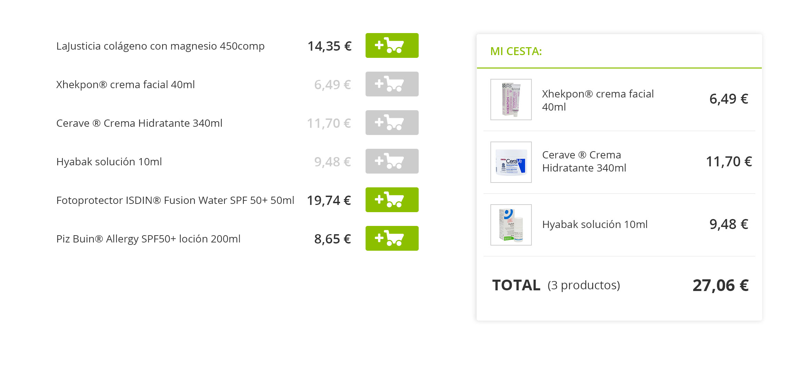
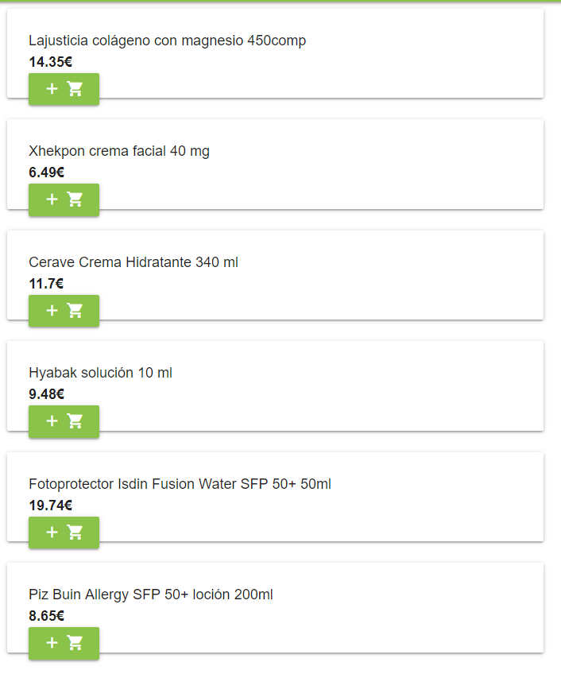
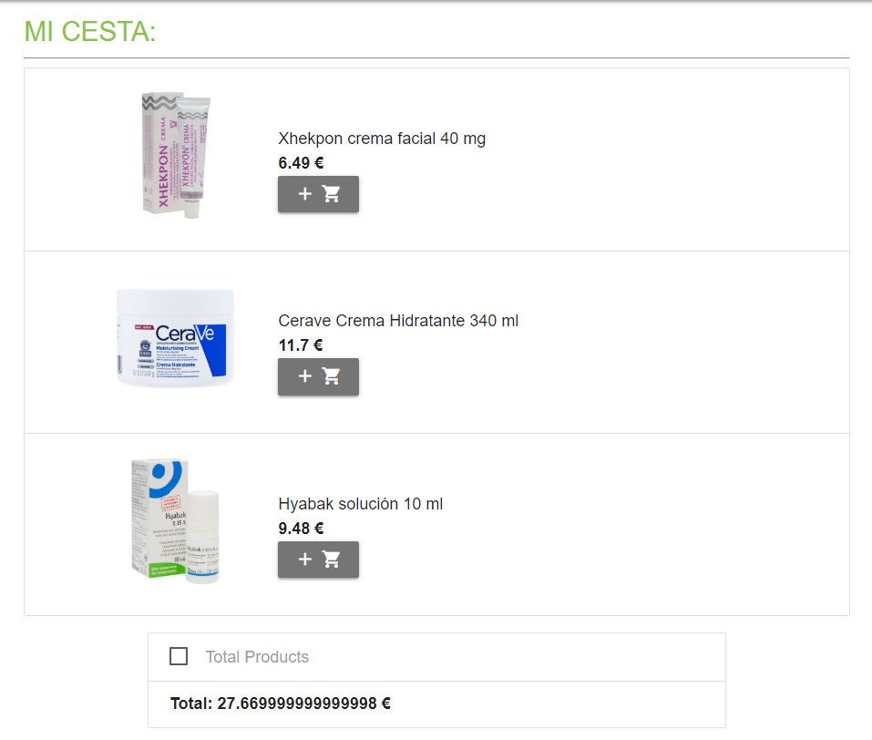

# PromoFarma frontend test 
shopping-cart is a Progresssive Web Application(PWA) with `React`, `Redux` and `Materialize.CSS` for e-commerce PromoFarma.

## Project Main Goal
Create a static web page according to mockup of two main components "Productlist" and "Shoppingcart".

### Features 
__Productlist:__
* A static list of Products 
* Add one product to the shopping-cart 
* At adding a product, Button will be disabled and turns grey.

__Shoppingcart:__
* Show the added product, the sum of the value of the products and the total of the elements. 
* If no products: shows 0 products and a Total price of 0 €.
* No need to delete items from the shoppingcart.
* In Mobile version, shopping card is a fixed section inside the screen (sticky image), it shows the price and total of products.


### Results



### Requirements to Get Started
* [Node.js](https://nodejs.org/en/)
* [NPM](https://www.npmjs.com/)
* [A terminal-Git Bash for Windows](https://gitforwindows.org/)

## Installation
This project is <b>Built with</b> startercode´s
- [Create-React-App](https://facebook.github.io/create-react-app/)

To create the __basic structure of a React app__:
```bash
npm install
```
 To __start the React App__: 
```bash
npm start
```
The application will start automatically in your browser on http://localhost:3000

### Install Dependencies 
This project uses the following __dependencies__:

* "materialize-css": "^1.0.0",
* "react": "^16.8.6",
* "react-dom": "^16.8.6",
* "react-redux": "^7.0.2",
* "react-router-dom": "^5.0.0",
* "react-scripts": "2.1.8",
* "redux": "^4.0.1"  
You can find the dependencies in the `package.json` file.
All dependencies can be installed via [NPM](https://www.npmjs.com/package/)

## Credits
These video´s helped me getting started to create a static E-commerce site:
- [JavaScript Shopping Cart Tutorial for Beginners-YouTube video](https://www.youtube.com/watch?v=YeFzkC2awTM)
- [React-Redux Shopping Cart DEMO-YouTube video](https://www.youtube.com/watch?v=J7Tw1hlK41E)

## Contributing

## License
[MIT]()©[Diana Vilé](https://github.com/dianavile/)
